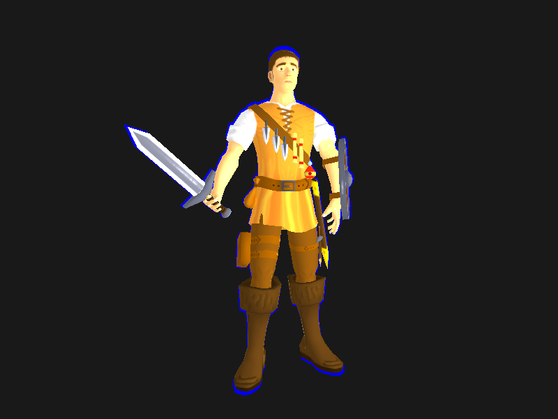
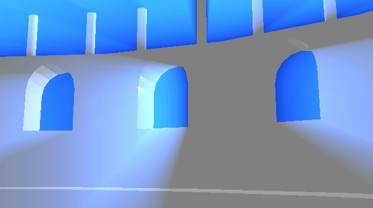
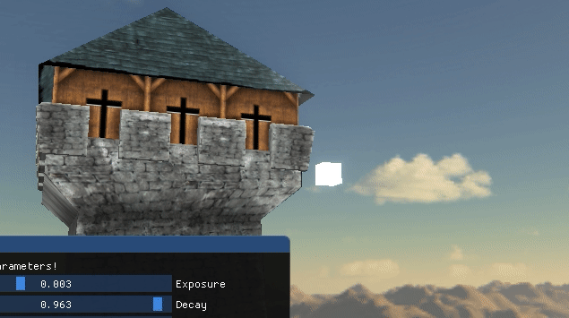
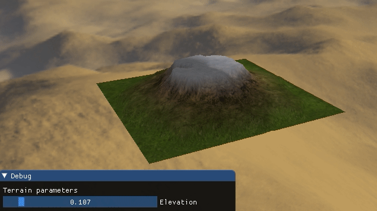
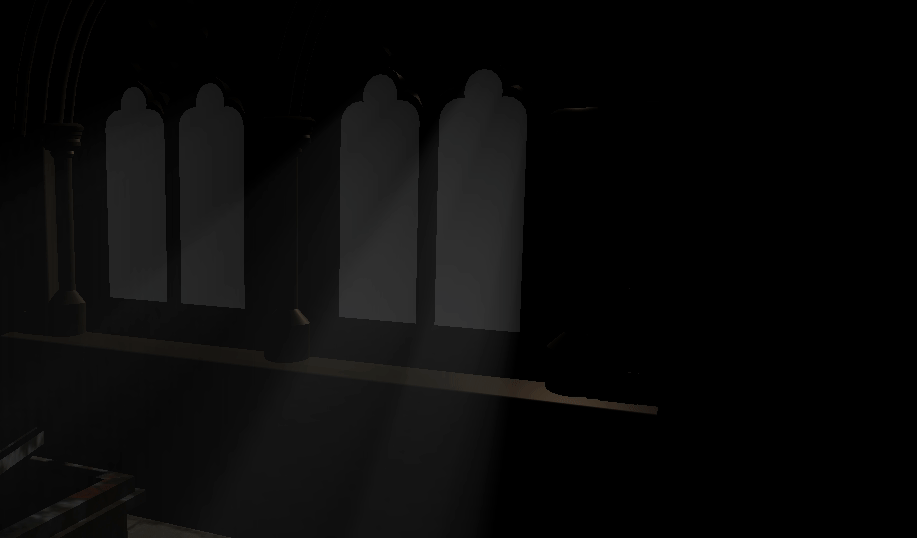

# Mike's OpenGL Sandbox

Purpose of this repo is showcasing 3D real-time techniques I gradually implement while studying OpenGL and CG in general. This is a "living" project, in a sense that it is going to be changed often.

Features implemented so far:
- Basic OBJ importer
- Simple Scene class
- Mesh (taking care of allocating VAO, VBO and EBO) and Model objects
- A scene showcasing 3D import, UV mapping and model outlining through Stencil and Depth buffers
- A scene showcasing basic post-process shaders
- A scene showcasing an implementation of light shafts (Godrays)
- Skybox
- Shaders class
- Heightmap-based Terrain with textures interpolation
- Shadow Mapping
- Render of a complex (horror) scene featuring shadow mapping and light shafts
- Normal mapping

# Some screenshots

